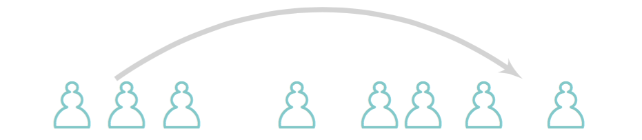

# Zelig Budget Tool Prototype  

 
This prototype system will allow researchers with sensitive datasets to make differentially private statistics about their data available through data repositories using the [Dataverse](https://dataverse.org/) platform. A paper describing our system can be found on [Arxiv](https://arxiv.org/pdf/1609.04340.pdf).      

As an intern, I worked on the beginning stages of the interactive GUI and researched applications of differential privacy software. I collaborated with [Nabib Ahmed](anhttps://github.com/Nashmed28), and I was advised by [Dr. James Honaker](http://hona.kr/) and [Jack Murtagh](https://scholar.harvard.edu/jmurtagh).      

# The PSI (Private Data Sharing Interface)
[PSI](https://beta.dataverse.org/custom/DifferentialPrivacyPrototype/) is a system of interlocking statistical tools for data exploration, analysis, and meta-analysis.  The first to be released is an interface for quantitative analysis, that allows users at all levels of statistical expertise to explore their data, describe their substantive understanding of the data, and appropriately construct statistical models. This integrates with [Dataverse](http://dataverse.org) and the [Zelig Project](http://zeligproject.org) through a portable, lightweight, browser-based and gesture-driven interface, allowing users to run statistical models available in Zelig on data archived in Dataverse.    
  
The demo of the [Budget Tool Interface] (https://beta.dataverse.org/custom/DifferentialPrivacyPrototype/UI/code/interface.html?fileid=20&UI=1) uses replication data from Fearon and Laitin's 2003 article *"Ethnicity, Insurgency, and Civil War"*.    

The [Budget Tool GUI](https://beta.dataverse.org/custom/DifferentialPrivacyPrototype/UI/code/interface.html?fileid=20&UI=1) allows data depositors to:
  * select variables of interest
  * select statistics of interest
  * allocate global privacy parameters ("the privacy budget")
  * interactively view accuracy rate of statistics
  * submit privacy budget

 

View the demo [here](https://vimeo.com/18064906).   

(Last Updated August 2016)  

<h1>Harvard University Privacy Tools</h1>
 
 This project is part of the [Privacy Tools Project](https://privacytools.seas.harvard.edu/), a broad effort to advance a multidisciplinary understanding of data privacy issues and build computational, statistical, legal, and policy tools to help address these issues in a variety of contexts. It is a collaborative effort between Harvard's Department of Computer Science, Center for Research on Computation and Society,  Institute for Quantitative Social Science. A National Science Foundation Secure and Trustworthy Cyberspace Project, with support from the Sloan Foundation and Google, Inc. 
    
