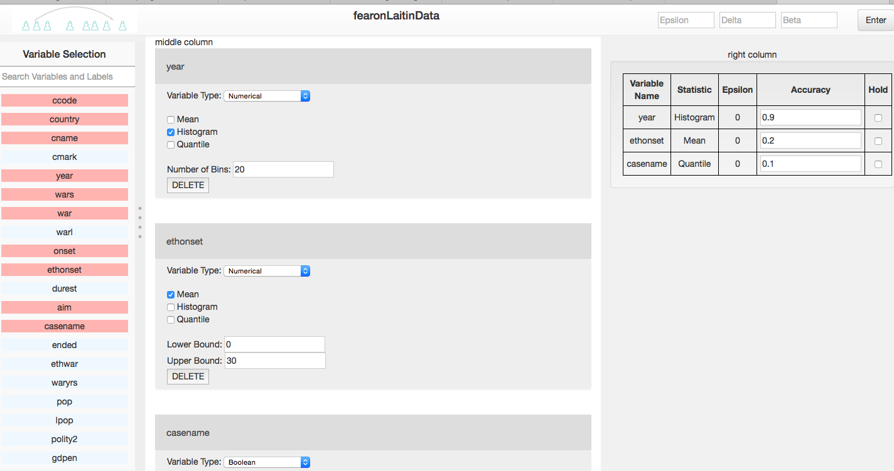

 **The PSI (Private Data Sharing Interface)** is a system of interlocking statistical tools for data exploration, analysis, and meta-analysis.  

The second to be released is an interface for data depostiors, that allows users at all levels of statistical expertise to explore their data, describe their substantive understanding of the data, and appropriately decide what aggregate statistics they feel suitable for release. This integrates with Dataverse ([Project](http://dataverse.org)|[GitHub](https://github.com/IQSS/dataverse)) and Zelig ([Project](http://zeligproject.org)|[GitHub](https://github.com/IQSS/Zelig)), through a portable, lightweight, browser-based and gesture-driven interface, allowing data depositors to allocate a "privacy budget" to sensitive datasets. 

To view the video demo of the Budget Tool using replication data from Fearon and Laitin's 2003 article, *Ethnicity, Insurgency, and Civil War*:
https://vimeo.com/180649061 

  

(Last Updated August 2016)
